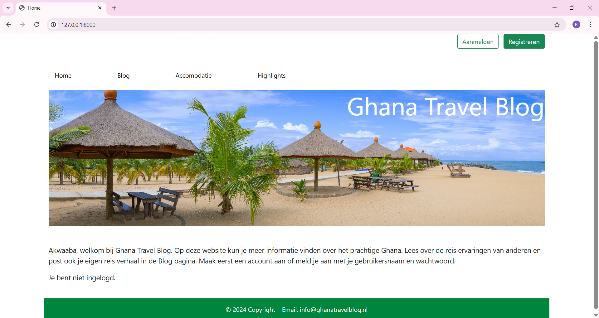
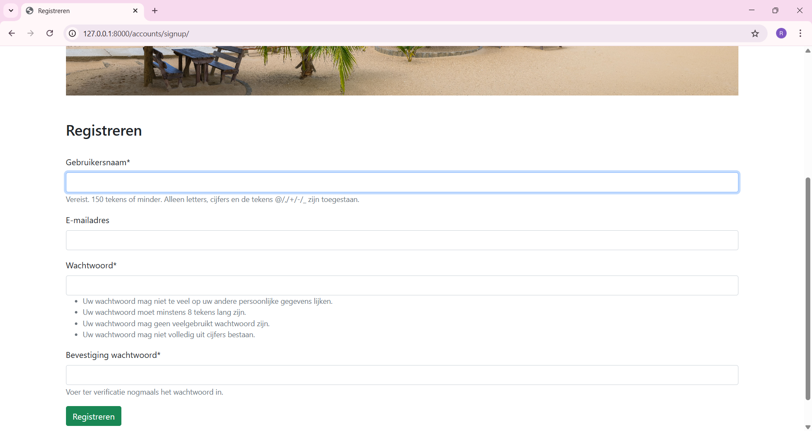
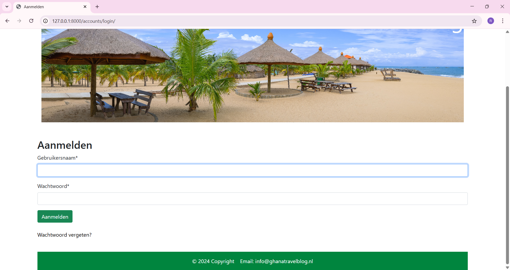
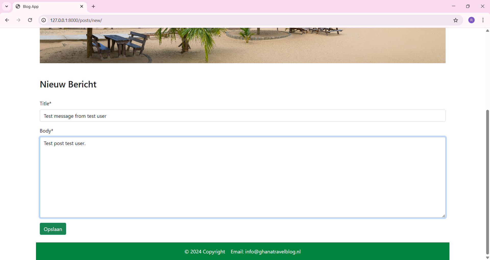
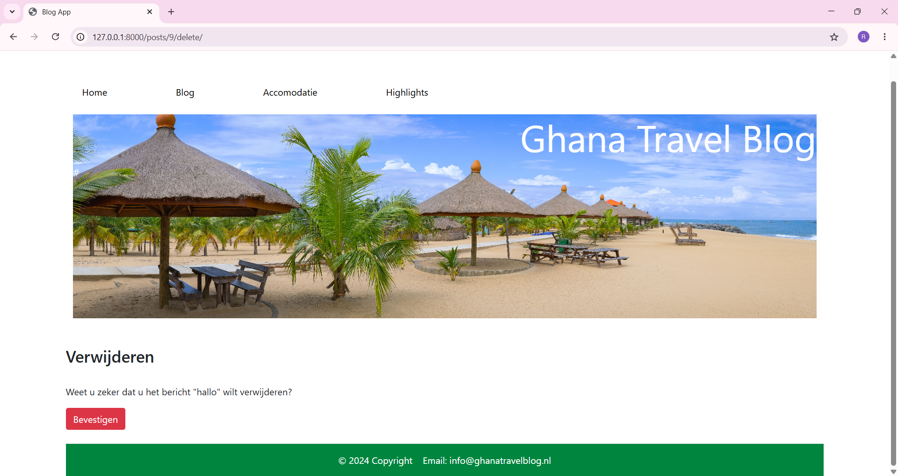
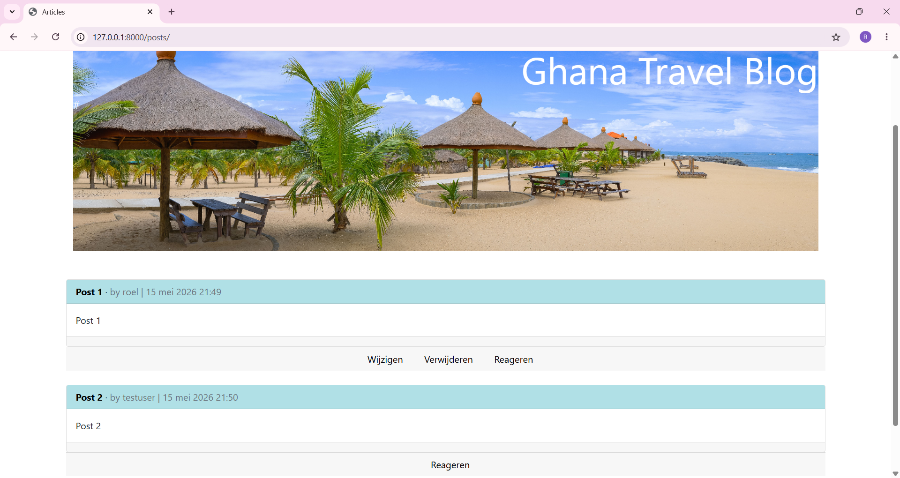
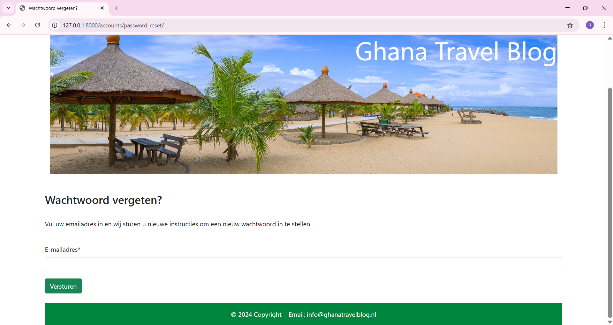
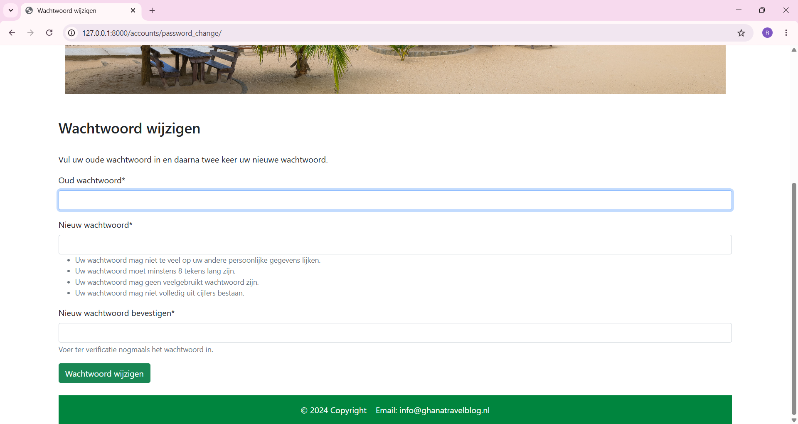
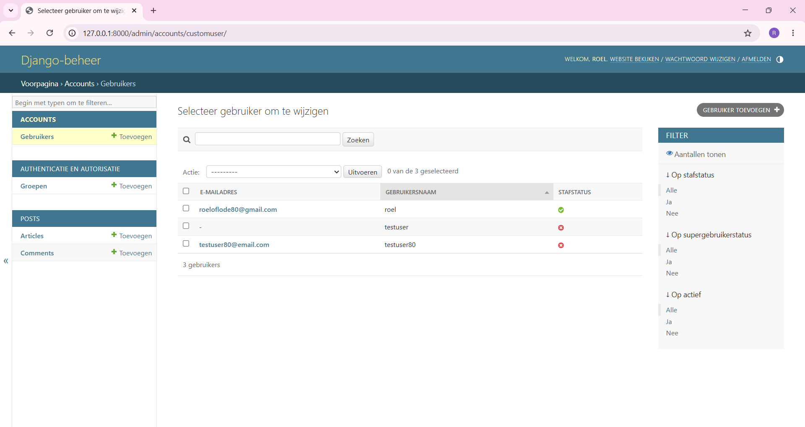

## Ghana Travel Blog Application

This is a Django blog application where visitors can share their travel experiences about Ghana online. 
For a clear and organized structure, the application is divided into three separate apps.
The Accounts app is responsible for the authentication. 
The Pages app handles the web pages, and the Posts app manages the data such as posts and comments that are stored in the database.

### Specifications

- Django Auth User Model
- Login and logout functions
- Password change and reset
- Create, Read, Update, Delete data (CRUD)
- Integrated SMTP email services
- Postgre SQL database on the backend
- Bootstrap 5 frontend
- Static CSS files
- Git version control
- Secure environment variables
- Secure form CSRF tokens
- Best practice cloud-based deployment on Heroku

## Images

#### Homepage

#### Registration

#### Login page

#### New post

#### Delete post

#### Post List view

#### Password reset

#### Password change

#### Admin panel

